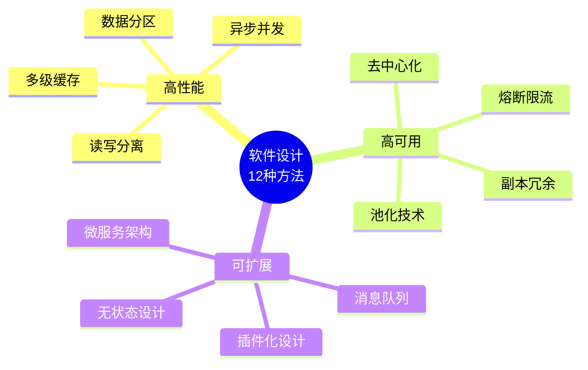
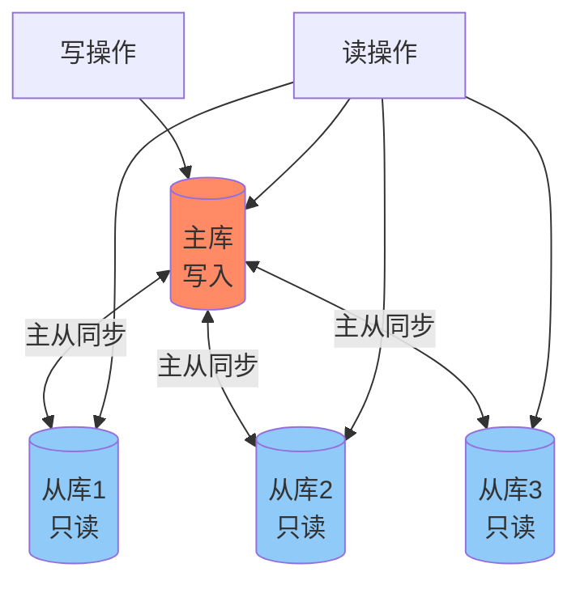
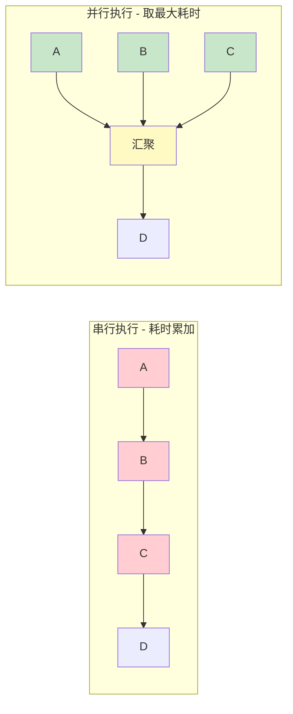
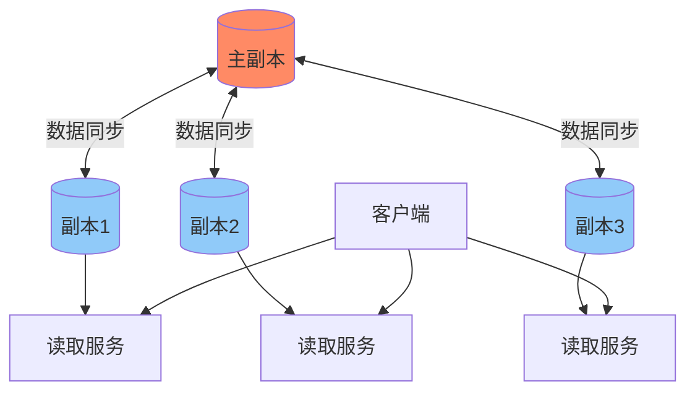
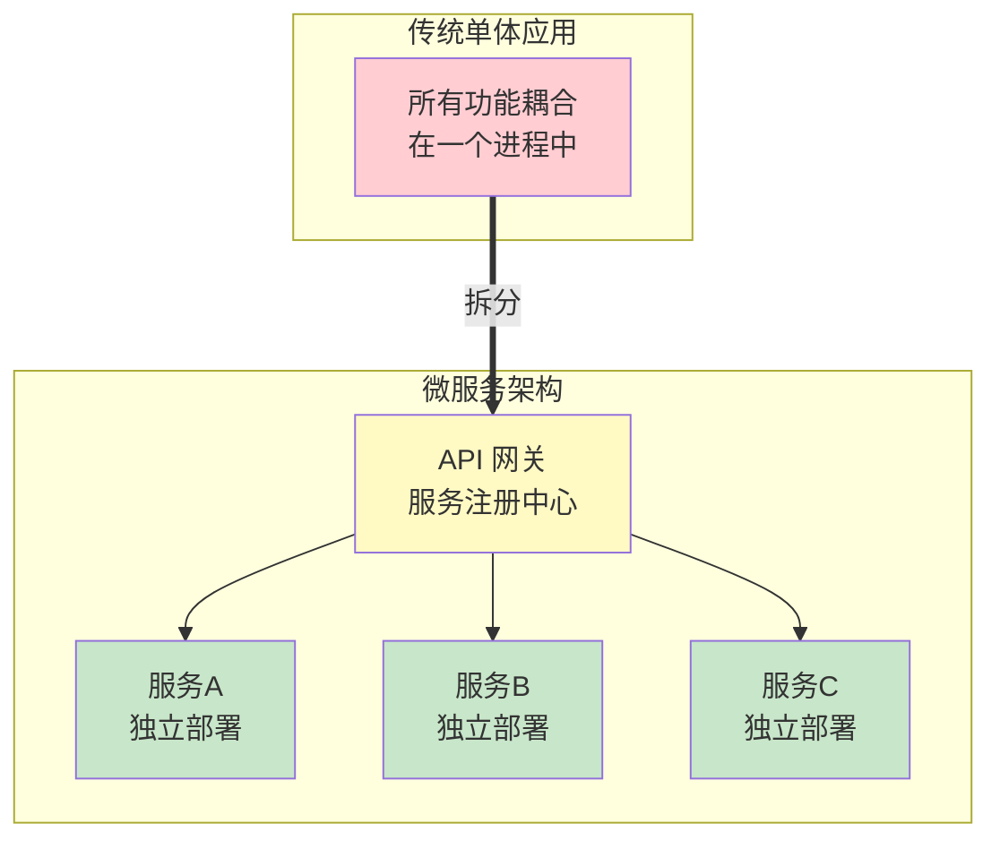
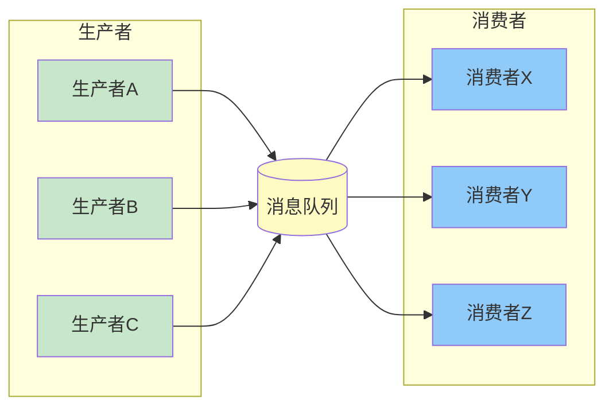
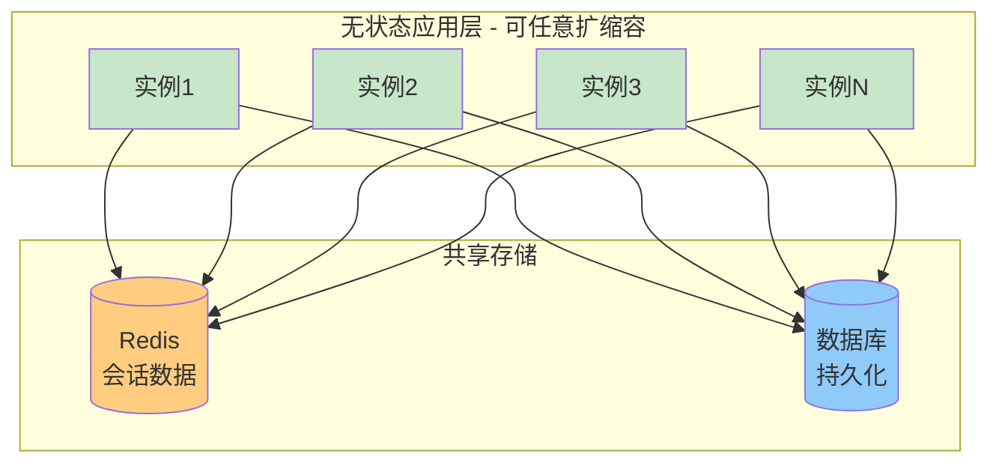
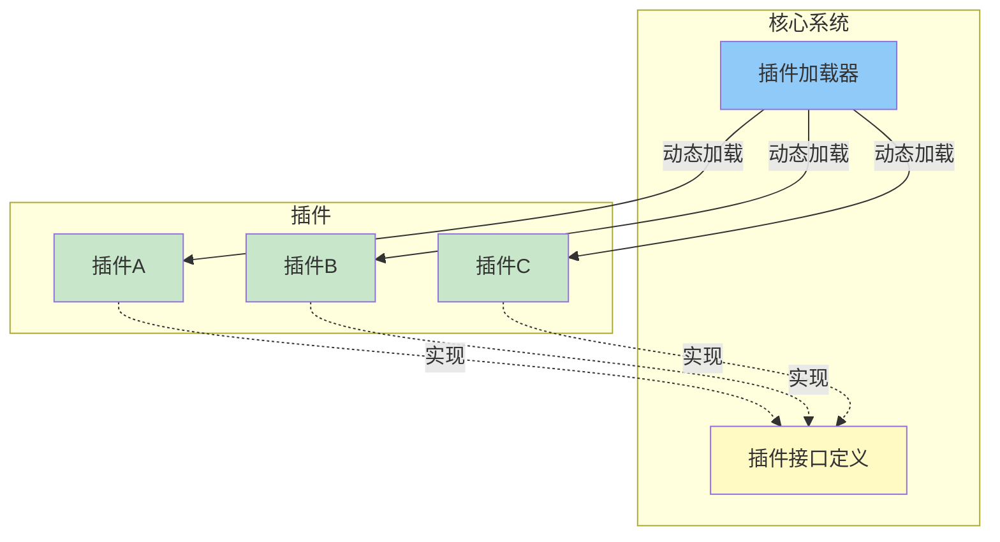

# 软件架构设计：12种核心方法总结

> 基于 IT老齐885 视频整理
> 三大目标：高性能 | 高可用 | 可扩展



---

## 总览对比

| 类别 | 方法 | 核心目标 | 关键技术 |
|:---:|:---|:---|:---|
| **高性能** | 多级缓存 | 减少数据访问延迟 | Redis、本地缓存、DB缓存 |
| | 读写分离 | 提升查询吞吐量 | 主从复制、读写路由 |
| | 数据分区 | 高效定位数据 | 水平分区、垂直分区 |
| | 异步并发 | 提升系统吞吐量 | 线程池、消息队列 |
| **高可用** | 熔断限流 | 保护系统不崩溃 | 令牌桶、熔断器 |
| | 池化技术 | 复用有限资源 | 连接池、线程池 |
| | 副本冗余 | 避免单点故障 | 主从复制、多副本 |
| | 去中心化 | 消除中心瓶颈 | Gossip协议、一致性算法 |
| **可扩展** | 微服务架构 | 业务独立演进 | 服务拆分、容器化 |
| | 消息队列 | 系统解耦 | Kafka、RocketMQ |
| | 无状态设计 | 支持水平扩展 | 状态外置、共享存储 |
| | 插件化设计 | 功能灵活扩展 | SPI、OSGi |

---

## 一、高性能架构设计

### 1.1 多级缓存 (Multi-level Cache)

**核心思想**：在数据访问路径中设置多个缓存层次，逐层拦截请求


**实践要点**：
| 缓存层级 | 技术选型 | 适用场景 |
|---------|---------|---------|
| 应用层缓存 | JVM内存/Guava/Caffeine | 热点数据、访问频率极高 |
| 分布式缓存 | Redis/Memcached | 大量热点数据、多实例共享 |
| 数据库缓存 | InnoDB Buffer Pool | 数据库内部优化 |

**成本考虑**：平衡内存成本与缓存命中率，设置合理的失效策略

---

### 1.2 读写分离 (Read-write Separation)

**核心思想**：将读操作和写操作分发到不同实例



**优势**：
- 查询性能大幅提升
- 读写互不阻塞

**注意事项**：
- 主从同步延迟问题（通常几十毫秒到几百毫秒）
- 强一致性业务需路由到主库
- 需监控同步延迟并设置报警

---

### 1.3 数据分区 (Data Partitioning)

**核心思想**：将大数据集切分成可管理的小块

**分区方式**：
- **水平分区**：按行切分（如按用户ID取模）
- **垂直分区**：按列切分（将冷热字段分离）
- **范围分区**：按时间、地区等范围划分

**收益**：
- 减少磁盘扫描范围
- 提高数据定位效率
- 便于数据归档和维护

---

### 1.4 异步并发 (Async & Concurrency)

**核心思想**：将大任务分解为并行处理的小任务



**应用场景**：
- 批量数据处理
- 外部接口调用
- 耗时计算任务

---

## 二、高可用架构设计

### 2.1 熔断与限流

| 机制 | 触发条件 | 作用 | 恢复机制 |
|------|---------|------|---------|
| **限流** | 请求量超过预设阈值 | 保护系统不被冲垮 | 超阈值直接拒绝 |
| **熔断** | 错误率/响应时间异常 | 防止雪崩效应 | 半开后逐步恢复 |

**常用算法**：
- 令牌桶算法
- 漏桶算法
- 固定窗口计数
- 滑动窗口计数

---

### 2.2 池化技术

**核心思想**：预制并管理有限资源，避免频繁创建销毁

**常见池化**：
- 数据库连接池（HikariCP、Druid）
- 线程池（ThreadPoolExecutor）
- 对象池（通用对象池）

**价值**：
- 控制下游资源不被超发
- 复用资源，降低创建开销
- 统一管理和监控

---

### 2.3 副本冗余

**核心思想**：为数据和服务创建多个副本



**应用场景**：
- 数据库主从复制
- 无状态应用多节点部署
- CDN内容分发
- 分布式存储

---

### 2.4 去中心化

**核心思想**：消除单点故障，避免中心节点成为瓶颈

**实现方式**：
- **节点互联**：如Redis集群的Gossip协议
- **客户端感知**：客户端直连多个数据库，自主选择
- **共识算法**：Paxos、Raft等分布式一致性协议

**收益**：
- 增强系统韧性
- 提升抗故障能力
- 支持水平扩展

---

## 三、可扩展架构设计

### 3.1 微服务架构

**核心思想**：将大系统拆分为独立部署、独立运行的小服务



**优势**：
- 业务模块独立扩展和部署
- 技术栈灵活选择
- 团队并行开发

---

### 3.2 消息队列

**核心思想**：通过中间代理实现生产者和消费者解耦



**常见实现**：
- Kafka：高吞吐量
- RocketMQ：事务消息
- RabbitMQ：协议丰富

**价值**：
- 系统解耦
- 流量削峰
- 异步处理
- 便于独立升级和水平扩展

---

### 3.3 无状态设计

**核心思想**：将状态外置到共享存储



**实践要点**：
- 会话数据存储在Redis
- 文件上传到对象存储
- 上下文信息由请求携带

---

### 3.4 插件化设计

**核心思想**：通过接口规范动态加载和扩展功能模块

**实现方式**：
- Java SPI (Service Provider Interface)
- OSGi
- 自定义插件机制



**收益**：
- 核心代码稳定
- 第三方可扩展
- 灵活的功能组合

---

## 设计原则总结

### 最低成本实现优化
```
性能优化：缓存 > 读写分离 > 数据分区
可用性保障：限流 > 熔断 > 冗余
扩展性设计：无状态 > 消息队列 > 微服务
```

### 权衡考虑
- 一致性 vs 可用性 (CAP定理)
- 延迟 vs 吞吐量
- 成本 vs 收益
- 简单性 vs 灵活性

---

## 适用场景建议

| 场景 | 推荐方案组合 |
|-----|-------------|
| 高并发读 | 多级缓存 + 读写分离 + 副本冗余 |
| 海量数据 | 数据分区 + 异步并发 + 消息队列 |
| 快速迭代 | 微服务 + 无状态设计 + 插件化 |
| 稳定优先 | 熔断限流 + 池化技术 + 副本冗余 |

---

**整理日期**：2026-02-23
**视频来源**：[IT老齐885 - 我工作中最常用的3类十二种软件设计方法](https://www.bilibili.com/video/BV1zpfFBCE78)
